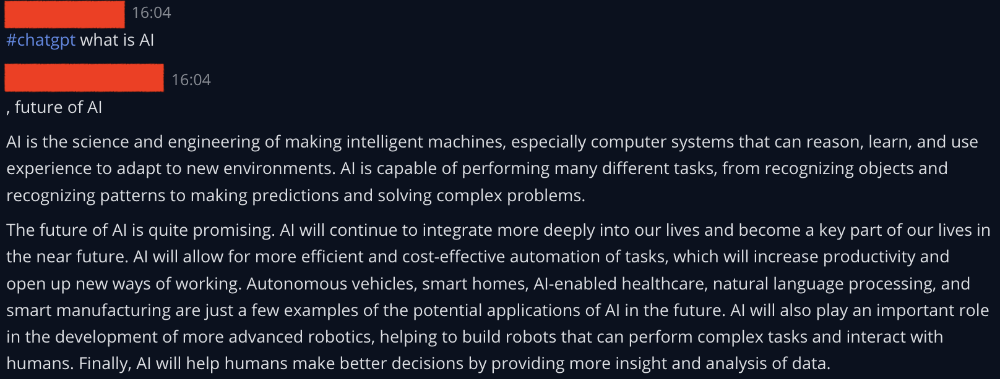
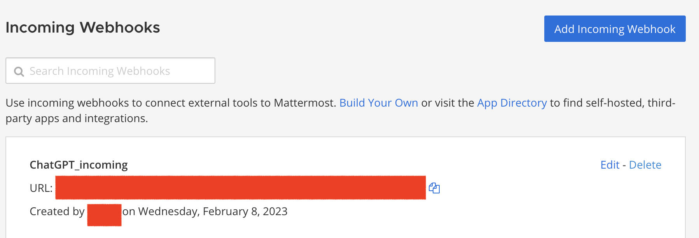
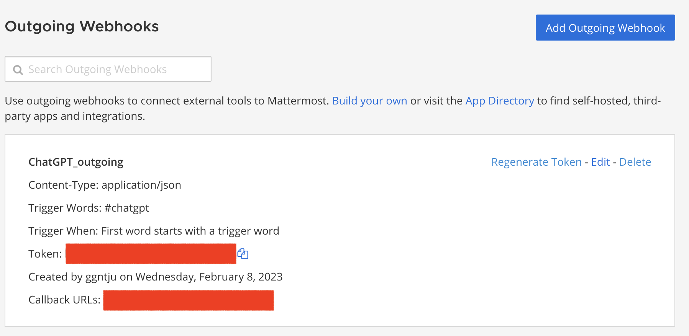

# chatgpt-mattermost-relay

## Getting Started

### Overview

_ChatGPT Mattermost Relay_ is a relay server which works as a bridge between OpenAI's ChatGPT API and Mattermost server. It uses outgoing webhook from Mattermost server to call the official API from ChatGPT and uses incoming webhook to receive response from ChatGPT. As in the above figure, user triggers the outgoing webhook by using **#chatgpt** followed by a prompt then a bot will give the response from ChatGPT.  

### How to use

* Fill JSON values in **template.json** and rename it as **config.json**
* Config **incoming webhook** in Mattermost Admin mode



* Config **outgoing webhook** in Mattermost Admin mode



* ```npm run start ``` or use the **run.sh** script to run the relay server in background


### Dependencies

- HTTP Client [Axios](https://axios-http.com/)

- HTTP Server [Express](https://expressjs.com/)

- OpenAI API [OpenAI](https://openai.com/api/)